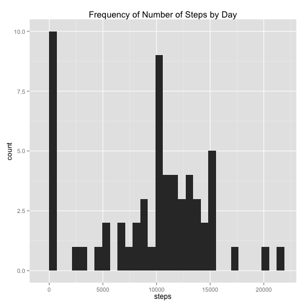
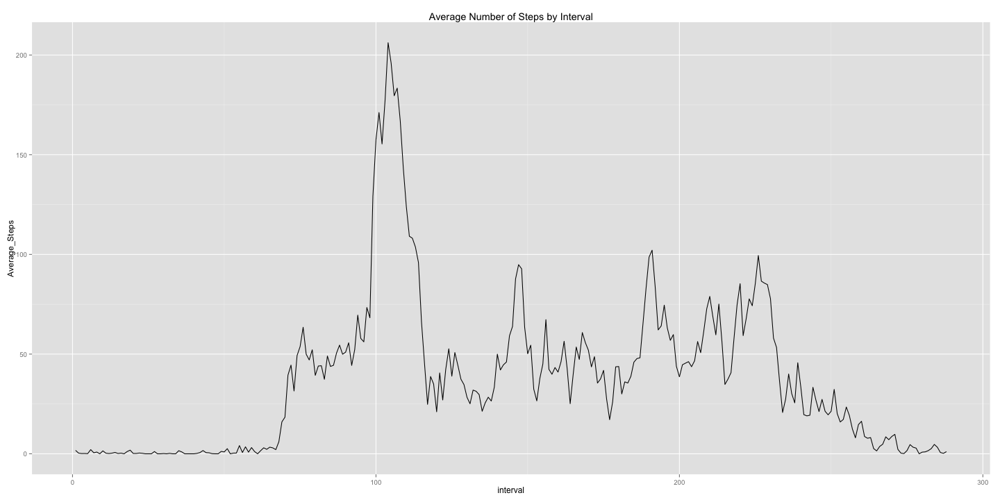
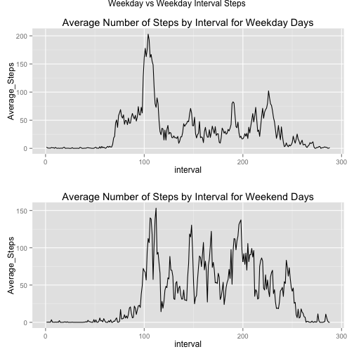

# Reproducible Research: Peer Assessment 1

## Loading and preprocessing the data
Load activity.csv file with a header

```r
activity <- read.csv("activity.csv", header=TRUE, na.strings="NA")
```

Clean up the data by converting internal to factor, and date to a Date

```r
##Convert interval to factor
activity$interval <- factor(activity$interval)
##Convert date to Date
activity$date <- as.Date(activity$date, format="%Y-%m-%d")
```


## What is mean total number of steps taken per day?
Create a data frame that shows the total amout of steps per day

```r
## Create steps vector
steps <- activity$steps
## Create a dates vector to group by
date <- activity$date
## Create data frame grouped by day
stepsByDay <- as.data.frame(rowsum(steps, date,na.rm=TRUE))
##Add Day as column and convert to Date
stepsByDay$date <- rownames(stepsByDay)
stepsByDay$date <- as.Date(stepsByDay$date, format="%Y-%m-%d")
colnames(stepsByDay) <- c("steps", "date")
```

Plot date in data frame using a histogram

```r
library("ggplot2")
ggplot(stepsByDay, aes(x=steps)) + geom_histogram() +
        ggtitle("Frequency of Number of Steps by Day")
```

 

Calculate mean and median steps per day

```r
##Produce a data frame with mean by day
meanSteps <- aggregate(steps ~ date, activity, mean, na.action=NULL)
meanSteps$date <- as.character(meanSteps$date)
colnames(meanSteps) <- c("date", "mean steps")
##Produce a data frame with median by day
medianSteps <- aggregate(steps ~ date, activity, median, na.action=NULL)
medianSteps$date <- as.character(medianSteps$date)
colnames(medianSteps) <- c("date", "median steps")
```

###Table of Mean(Left) and Median(Right) By Day

```r
library(knitr)
t1 = kable(meanSteps, format='html', output = FALSE)
t2 = kable(medianSteps, format='html', output = FALSE)
cat(c('<table><tr valign="top"><td>', t1, '</td><td>', t2, '</td><tr></table>'),
    sep = '')
```

<table><tr valign="top"><td><table>
 <thead>
  <tr>
   <th align="left"> date </th>
   <th align="right"> mean steps </th>
  </tr>
 </thead>
<tbody>
  <tr>
   <td align="left"> 2012-10-01 </td>
   <td align="right"> NA </td>
  </tr>
  <tr>
   <td align="left"> 2012-10-02 </td>
   <td align="right"> 0.4375 </td>
  </tr>
  <tr>
   <td align="left"> 2012-10-03 </td>
   <td align="right"> 39.4167 </td>
  </tr>
  <tr>
   <td align="left"> 2012-10-04 </td>
   <td align="right"> 42.0694 </td>
  </tr>
  <tr>
   <td align="left"> 2012-10-05 </td>
   <td align="right"> 46.1597 </td>
  </tr>
  <tr>
   <td align="left"> 2012-10-06 </td>
   <td align="right"> 53.5417 </td>
  </tr>
  <tr>
   <td align="left"> 2012-10-07 </td>
   <td align="right"> 38.2465 </td>
  </tr>
  <tr>
   <td align="left"> 2012-10-08 </td>
   <td align="right"> NA </td>
  </tr>
  <tr>
   <td align="left"> 2012-10-09 </td>
   <td align="right"> 44.4826 </td>
  </tr>
  <tr>
   <td align="left"> 2012-10-10 </td>
   <td align="right"> 34.3750 </td>
  </tr>
  <tr>
   <td align="left"> 2012-10-11 </td>
   <td align="right"> 35.7778 </td>
  </tr>
  <tr>
   <td align="left"> 2012-10-12 </td>
   <td align="right"> 60.3542 </td>
  </tr>
  <tr>
   <td align="left"> 2012-10-13 </td>
   <td align="right"> 43.1458 </td>
  </tr>
  <tr>
   <td align="left"> 2012-10-14 </td>
   <td align="right"> 52.4236 </td>
  </tr>
  <tr>
   <td align="left"> 2012-10-15 </td>
   <td align="right"> 35.2049 </td>
  </tr>
  <tr>
   <td align="left"> 2012-10-16 </td>
   <td align="right"> 52.3750 </td>
  </tr>
  <tr>
   <td align="left"> 2012-10-17 </td>
   <td align="right"> 46.7083 </td>
  </tr>
  <tr>
   <td align="left"> 2012-10-18 </td>
   <td align="right"> 34.9167 </td>
  </tr>
  <tr>
   <td align="left"> 2012-10-19 </td>
   <td align="right"> 41.0729 </td>
  </tr>
  <tr>
   <td align="left"> 2012-10-20 </td>
   <td align="right"> 36.0938 </td>
  </tr>
  <tr>
   <td align="left"> 2012-10-21 </td>
   <td align="right"> 30.6285 </td>
  </tr>
  <tr>
   <td align="left"> 2012-10-22 </td>
   <td align="right"> 46.7361 </td>
  </tr>
  <tr>
   <td align="left"> 2012-10-23 </td>
   <td align="right"> 30.9653 </td>
  </tr>
  <tr>
   <td align="left"> 2012-10-24 </td>
   <td align="right"> 29.0104 </td>
  </tr>
  <tr>
   <td align="left"> 2012-10-25 </td>
   <td align="right"> 8.6528 </td>
  </tr>
  <tr>
   <td align="left"> 2012-10-26 </td>
   <td align="right"> 23.5347 </td>
  </tr>
  <tr>
   <td align="left"> 2012-10-27 </td>
   <td align="right"> 35.1354 </td>
  </tr>
  <tr>
   <td align="left"> 2012-10-28 </td>
   <td align="right"> 39.7847 </td>
  </tr>
  <tr>
   <td align="left"> 2012-10-29 </td>
   <td align="right"> 17.4236 </td>
  </tr>
  <tr>
   <td align="left"> 2012-10-30 </td>
   <td align="right"> 34.0938 </td>
  </tr>
  <tr>
   <td align="left"> 2012-10-31 </td>
   <td align="right"> 53.5208 </td>
  </tr>
  <tr>
   <td align="left"> 2012-11-01 </td>
   <td align="right"> NA </td>
  </tr>
  <tr>
   <td align="left"> 2012-11-02 </td>
   <td align="right"> 36.8056 </td>
  </tr>
  <tr>
   <td align="left"> 2012-11-03 </td>
   <td align="right"> 36.7049 </td>
  </tr>
  <tr>
   <td align="left"> 2012-11-04 </td>
   <td align="right"> NA </td>
  </tr>
  <tr>
   <td align="left"> 2012-11-05 </td>
   <td align="right"> 36.2465 </td>
  </tr>
  <tr>
   <td align="left"> 2012-11-06 </td>
   <td align="right"> 28.9375 </td>
  </tr>
  <tr>
   <td align="left"> 2012-11-07 </td>
   <td align="right"> 44.7326 </td>
  </tr>
  <tr>
   <td align="left"> 2012-11-08 </td>
   <td align="right"> 11.1771 </td>
  </tr>
  <tr>
   <td align="left"> 2012-11-09 </td>
   <td align="right"> NA </td>
  </tr>
  <tr>
   <td align="left"> 2012-11-10 </td>
   <td align="right"> NA </td>
  </tr>
  <tr>
   <td align="left"> 2012-11-11 </td>
   <td align="right"> 43.7778 </td>
  </tr>
  <tr>
   <td align="left"> 2012-11-12 </td>
   <td align="right"> 37.3785 </td>
  </tr>
  <tr>
   <td align="left"> 2012-11-13 </td>
   <td align="right"> 25.4722 </td>
  </tr>
  <tr>
   <td align="left"> 2012-11-14 </td>
   <td align="right"> NA </td>
  </tr>
  <tr>
   <td align="left"> 2012-11-15 </td>
   <td align="right"> 0.1424 </td>
  </tr>
  <tr>
   <td align="left"> 2012-11-16 </td>
   <td align="right"> 18.8924 </td>
  </tr>
  <tr>
   <td align="left"> 2012-11-17 </td>
   <td align="right"> 49.7882 </td>
  </tr>
  <tr>
   <td align="left"> 2012-11-18 </td>
   <td align="right"> 52.4653 </td>
  </tr>
  <tr>
   <td align="left"> 2012-11-19 </td>
   <td align="right"> 30.6979 </td>
  </tr>
  <tr>
   <td align="left"> 2012-11-20 </td>
   <td align="right"> 15.5278 </td>
  </tr>
  <tr>
   <td align="left"> 2012-11-21 </td>
   <td align="right"> 44.3993 </td>
  </tr>
  <tr>
   <td align="left"> 2012-11-22 </td>
   <td align="right"> 70.9271 </td>
  </tr>
  <tr>
   <td align="left"> 2012-11-23 </td>
   <td align="right"> 73.5903 </td>
  </tr>
  <tr>
   <td align="left"> 2012-11-24 </td>
   <td align="right"> 50.2708 </td>
  </tr>
  <tr>
   <td align="left"> 2012-11-25 </td>
   <td align="right"> 41.0903 </td>
  </tr>
  <tr>
   <td align="left"> 2012-11-26 </td>
   <td align="right"> 38.7569 </td>
  </tr>
  <tr>
   <td align="left"> 2012-11-27 </td>
   <td align="right"> 47.3819 </td>
  </tr>
  <tr>
   <td align="left"> 2012-11-28 </td>
   <td align="right"> 35.3576 </td>
  </tr>
  <tr>
   <td align="left"> 2012-11-29 </td>
   <td align="right"> 24.4688 </td>
  </tr>
  <tr>
   <td align="left"> 2012-11-30 </td>
   <td align="right"> NA </td>
  </tr>
</tbody>
</table></td><td><table>
 <thead>
  <tr>
   <th align="left"> date </th>
   <th align="right"> median steps </th>
  </tr>
 </thead>
<tbody>
  <tr>
   <td align="left"> 2012-10-01 </td>
   <td align="right"> NA </td>
  </tr>
  <tr>
   <td align="left"> 2012-10-02 </td>
   <td align="right"> 0 </td>
  </tr>
  <tr>
   <td align="left"> 2012-10-03 </td>
   <td align="right"> 0 </td>
  </tr>
  <tr>
   <td align="left"> 2012-10-04 </td>
   <td align="right"> 0 </td>
  </tr>
  <tr>
   <td align="left"> 2012-10-05 </td>
   <td align="right"> 0 </td>
  </tr>
  <tr>
   <td align="left"> 2012-10-06 </td>
   <td align="right"> 0 </td>
  </tr>
  <tr>
   <td align="left"> 2012-10-07 </td>
   <td align="right"> 0 </td>
  </tr>
  <tr>
   <td align="left"> 2012-10-08 </td>
   <td align="right"> NA </td>
  </tr>
  <tr>
   <td align="left"> 2012-10-09 </td>
   <td align="right"> 0 </td>
  </tr>
  <tr>
   <td align="left"> 2012-10-10 </td>
   <td align="right"> 0 </td>
  </tr>
  <tr>
   <td align="left"> 2012-10-11 </td>
   <td align="right"> 0 </td>
  </tr>
  <tr>
   <td align="left"> 2012-10-12 </td>
   <td align="right"> 0 </td>
  </tr>
  <tr>
   <td align="left"> 2012-10-13 </td>
   <td align="right"> 0 </td>
  </tr>
  <tr>
   <td align="left"> 2012-10-14 </td>
   <td align="right"> 0 </td>
  </tr>
  <tr>
   <td align="left"> 2012-10-15 </td>
   <td align="right"> 0 </td>
  </tr>
  <tr>
   <td align="left"> 2012-10-16 </td>
   <td align="right"> 0 </td>
  </tr>
  <tr>
   <td align="left"> 2012-10-17 </td>
   <td align="right"> 0 </td>
  </tr>
  <tr>
   <td align="left"> 2012-10-18 </td>
   <td align="right"> 0 </td>
  </tr>
  <tr>
   <td align="left"> 2012-10-19 </td>
   <td align="right"> 0 </td>
  </tr>
  <tr>
   <td align="left"> 2012-10-20 </td>
   <td align="right"> 0 </td>
  </tr>
  <tr>
   <td align="left"> 2012-10-21 </td>
   <td align="right"> 0 </td>
  </tr>
  <tr>
   <td align="left"> 2012-10-22 </td>
   <td align="right"> 0 </td>
  </tr>
  <tr>
   <td align="left"> 2012-10-23 </td>
   <td align="right"> 0 </td>
  </tr>
  <tr>
   <td align="left"> 2012-10-24 </td>
   <td align="right"> 0 </td>
  </tr>
  <tr>
   <td align="left"> 2012-10-25 </td>
   <td align="right"> 0 </td>
  </tr>
  <tr>
   <td align="left"> 2012-10-26 </td>
   <td align="right"> 0 </td>
  </tr>
  <tr>
   <td align="left"> 2012-10-27 </td>
   <td align="right"> 0 </td>
  </tr>
  <tr>
   <td align="left"> 2012-10-28 </td>
   <td align="right"> 0 </td>
  </tr>
  <tr>
   <td align="left"> 2012-10-29 </td>
   <td align="right"> 0 </td>
  </tr>
  <tr>
   <td align="left"> 2012-10-30 </td>
   <td align="right"> 0 </td>
  </tr>
  <tr>
   <td align="left"> 2012-10-31 </td>
   <td align="right"> 0 </td>
  </tr>
  <tr>
   <td align="left"> 2012-11-01 </td>
   <td align="right"> NA </td>
  </tr>
  <tr>
   <td align="left"> 2012-11-02 </td>
   <td align="right"> 0 </td>
  </tr>
  <tr>
   <td align="left"> 2012-11-03 </td>
   <td align="right"> 0 </td>
  </tr>
  <tr>
   <td align="left"> 2012-11-04 </td>
   <td align="right"> NA </td>
  </tr>
  <tr>
   <td align="left"> 2012-11-05 </td>
   <td align="right"> 0 </td>
  </tr>
  <tr>
   <td align="left"> 2012-11-06 </td>
   <td align="right"> 0 </td>
  </tr>
  <tr>
   <td align="left"> 2012-11-07 </td>
   <td align="right"> 0 </td>
  </tr>
  <tr>
   <td align="left"> 2012-11-08 </td>
   <td align="right"> 0 </td>
  </tr>
  <tr>
   <td align="left"> 2012-11-09 </td>
   <td align="right"> NA </td>
  </tr>
  <tr>
   <td align="left"> 2012-11-10 </td>
   <td align="right"> NA </td>
  </tr>
  <tr>
   <td align="left"> 2012-11-11 </td>
   <td align="right"> 0 </td>
  </tr>
  <tr>
   <td align="left"> 2012-11-12 </td>
   <td align="right"> 0 </td>
  </tr>
  <tr>
   <td align="left"> 2012-11-13 </td>
   <td align="right"> 0 </td>
  </tr>
  <tr>
   <td align="left"> 2012-11-14 </td>
   <td align="right"> NA </td>
  </tr>
  <tr>
   <td align="left"> 2012-11-15 </td>
   <td align="right"> 0 </td>
  </tr>
  <tr>
   <td align="left"> 2012-11-16 </td>
   <td align="right"> 0 </td>
  </tr>
  <tr>
   <td align="left"> 2012-11-17 </td>
   <td align="right"> 0 </td>
  </tr>
  <tr>
   <td align="left"> 2012-11-18 </td>
   <td align="right"> 0 </td>
  </tr>
  <tr>
   <td align="left"> 2012-11-19 </td>
   <td align="right"> 0 </td>
  </tr>
  <tr>
   <td align="left"> 2012-11-20 </td>
   <td align="right"> 0 </td>
  </tr>
  <tr>
   <td align="left"> 2012-11-21 </td>
   <td align="right"> 0 </td>
  </tr>
  <tr>
   <td align="left"> 2012-11-22 </td>
   <td align="right"> 0 </td>
  </tr>
  <tr>
   <td align="left"> 2012-11-23 </td>
   <td align="right"> 0 </td>
  </tr>
  <tr>
   <td align="left"> 2012-11-24 </td>
   <td align="right"> 0 </td>
  </tr>
  <tr>
   <td align="left"> 2012-11-25 </td>
   <td align="right"> 0 </td>
  </tr>
  <tr>
   <td align="left"> 2012-11-26 </td>
   <td align="right"> 0 </td>
  </tr>
  <tr>
   <td align="left"> 2012-11-27 </td>
   <td align="right"> 0 </td>
  </tr>
  <tr>
   <td align="left"> 2012-11-28 </td>
   <td align="right"> 0 </td>
  </tr>
  <tr>
   <td align="left"> 2012-11-29 </td>
   <td align="right"> 0 </td>
  </tr>
  <tr>
   <td align="left"> 2012-11-30 </td>
   <td align="right"> NA </td>
  </tr>
</tbody>
</table></td><tr></table>


## What is the average daily activity pattern?
###Plot  of the 5-minute interval and the average number of steps taken, 
###averaged across all days (y-axis)

```r
meanStepsByInterval <- aggregate(steps ~ interval, activity, mean, 
        na.action=na.omit)
##Set mean steps as numeric and clean up column names
colnames(meanStepsByInterval) <- c("interval", "Average_Steps")
meanStepsByInterval$interval <- as.numeric(meanStepsByInterval$interval)
ggplot(meanStepsByInterval, aes(interval, Average_Steps)) + geom_line() +
    ggtitle("Average Number of Steps by Interval")
```

 

Calculate the interval with the highest average (accross all days)

```r
maxInterval <- which.max(meanStepsByInterval$Average_Steps)
meanStepsByInterval[maxInterval,]
```

```
##     interval Average_Steps
## 104      104         206.2
```

## Imputing missing values

The number of NAs is:

```r
length(which(is.na(activity$steps)))
```

```
## [1] 2304
```

Replace missing NA values with the mean of their interval:

```r
##Convert interval to numeric
activity$interval <- as.numeric(activity$interval)
##Merge average steps by Interval into activity data frame
activityFill <- merge(activity, meanStepsByInterval, by="interval")
##Replace NAs with mean of interval
activityFill$steps[is.na(activityFill$steps)] <- activityFill$Average_Steps
```

Calculate mean and median steps per day

```r
##Produce a data frame with mean by day
meanStepsFill <- aggregate(steps ~ date, activityFill, mean, na.action=NULL)
meanStepsFill$date <- as.character(meanStepsFill$date)
colnames(meanStepsFill) <- c("date", "mean steps")
##Produce a data frame with median by day
medianStepsFill <- aggregate(steps ~ date, activityFill, median, 
        na.action=NULL)
medianStepsFill$date <- as.character(medianStepsFill$date)
colnames(medianStepsFill) <- c("date", "median steps")
```

###Show original mean table (left) vs NA Filled (right)

```r
t1 = kable(meanSteps, format='html', output = FALSE)
t2 = kable(meanStepsFill, format='html', output = FALSE)
cat(c('<table><tr valign="top"><td>', t1, '</td><td>', t2, '</td><tr></table>'),
    sep = '')
```

<table><tr valign="top"><td><table>
 <thead>
  <tr>
   <th align="left"> date </th>
   <th align="right"> mean steps </th>
  </tr>
 </thead>
<tbody>
  <tr>
   <td align="left"> 2012-10-01 </td>
   <td align="right"> NA </td>
  </tr>
  <tr>
   <td align="left"> 2012-10-02 </td>
   <td align="right"> 0.4375 </td>
  </tr>
  <tr>
   <td align="left"> 2012-10-03 </td>
   <td align="right"> 39.4167 </td>
  </tr>
  <tr>
   <td align="left"> 2012-10-04 </td>
   <td align="right"> 42.0694 </td>
  </tr>
  <tr>
   <td align="left"> 2012-10-05 </td>
   <td align="right"> 46.1597 </td>
  </tr>
  <tr>
   <td align="left"> 2012-10-06 </td>
   <td align="right"> 53.5417 </td>
  </tr>
  <tr>
   <td align="left"> 2012-10-07 </td>
   <td align="right"> 38.2465 </td>
  </tr>
  <tr>
   <td align="left"> 2012-10-08 </td>
   <td align="right"> NA </td>
  </tr>
  <tr>
   <td align="left"> 2012-10-09 </td>
   <td align="right"> 44.4826 </td>
  </tr>
  <tr>
   <td align="left"> 2012-10-10 </td>
   <td align="right"> 34.3750 </td>
  </tr>
  <tr>
   <td align="left"> 2012-10-11 </td>
   <td align="right"> 35.7778 </td>
  </tr>
  <tr>
   <td align="left"> 2012-10-12 </td>
   <td align="right"> 60.3542 </td>
  </tr>
  <tr>
   <td align="left"> 2012-10-13 </td>
   <td align="right"> 43.1458 </td>
  </tr>
  <tr>
   <td align="left"> 2012-10-14 </td>
   <td align="right"> 52.4236 </td>
  </tr>
  <tr>
   <td align="left"> 2012-10-15 </td>
   <td align="right"> 35.2049 </td>
  </tr>
  <tr>
   <td align="left"> 2012-10-16 </td>
   <td align="right"> 52.3750 </td>
  </tr>
  <tr>
   <td align="left"> 2012-10-17 </td>
   <td align="right"> 46.7083 </td>
  </tr>
  <tr>
   <td align="left"> 2012-10-18 </td>
   <td align="right"> 34.9167 </td>
  </tr>
  <tr>
   <td align="left"> 2012-10-19 </td>
   <td align="right"> 41.0729 </td>
  </tr>
  <tr>
   <td align="left"> 2012-10-20 </td>
   <td align="right"> 36.0938 </td>
  </tr>
  <tr>
   <td align="left"> 2012-10-21 </td>
   <td align="right"> 30.6285 </td>
  </tr>
  <tr>
   <td align="left"> 2012-10-22 </td>
   <td align="right"> 46.7361 </td>
  </tr>
  <tr>
   <td align="left"> 2012-10-23 </td>
   <td align="right"> 30.9653 </td>
  </tr>
  <tr>
   <td align="left"> 2012-10-24 </td>
   <td align="right"> 29.0104 </td>
  </tr>
  <tr>
   <td align="left"> 2012-10-25 </td>
   <td align="right"> 8.6528 </td>
  </tr>
  <tr>
   <td align="left"> 2012-10-26 </td>
   <td align="right"> 23.5347 </td>
  </tr>
  <tr>
   <td align="left"> 2012-10-27 </td>
   <td align="right"> 35.1354 </td>
  </tr>
  <tr>
   <td align="left"> 2012-10-28 </td>
   <td align="right"> 39.7847 </td>
  </tr>
  <tr>
   <td align="left"> 2012-10-29 </td>
   <td align="right"> 17.4236 </td>
  </tr>
  <tr>
   <td align="left"> 2012-10-30 </td>
   <td align="right"> 34.0938 </td>
  </tr>
  <tr>
   <td align="left"> 2012-10-31 </td>
   <td align="right"> 53.5208 </td>
  </tr>
  <tr>
   <td align="left"> 2012-11-01 </td>
   <td align="right"> NA </td>
  </tr>
  <tr>
   <td align="left"> 2012-11-02 </td>
   <td align="right"> 36.8056 </td>
  </tr>
  <tr>
   <td align="left"> 2012-11-03 </td>
   <td align="right"> 36.7049 </td>
  </tr>
  <tr>
   <td align="left"> 2012-11-04 </td>
   <td align="right"> NA </td>
  </tr>
  <tr>
   <td align="left"> 2012-11-05 </td>
   <td align="right"> 36.2465 </td>
  </tr>
  <tr>
   <td align="left"> 2012-11-06 </td>
   <td align="right"> 28.9375 </td>
  </tr>
  <tr>
   <td align="left"> 2012-11-07 </td>
   <td align="right"> 44.7326 </td>
  </tr>
  <tr>
   <td align="left"> 2012-11-08 </td>
   <td align="right"> 11.1771 </td>
  </tr>
  <tr>
   <td align="left"> 2012-11-09 </td>
   <td align="right"> NA </td>
  </tr>
  <tr>
   <td align="left"> 2012-11-10 </td>
   <td align="right"> NA </td>
  </tr>
  <tr>
   <td align="left"> 2012-11-11 </td>
   <td align="right"> 43.7778 </td>
  </tr>
  <tr>
   <td align="left"> 2012-11-12 </td>
   <td align="right"> 37.3785 </td>
  </tr>
  <tr>
   <td align="left"> 2012-11-13 </td>
   <td align="right"> 25.4722 </td>
  </tr>
  <tr>
   <td align="left"> 2012-11-14 </td>
   <td align="right"> NA </td>
  </tr>
  <tr>
   <td align="left"> 2012-11-15 </td>
   <td align="right"> 0.1424 </td>
  </tr>
  <tr>
   <td align="left"> 2012-11-16 </td>
   <td align="right"> 18.8924 </td>
  </tr>
  <tr>
   <td align="left"> 2012-11-17 </td>
   <td align="right"> 49.7882 </td>
  </tr>
  <tr>
   <td align="left"> 2012-11-18 </td>
   <td align="right"> 52.4653 </td>
  </tr>
  <tr>
   <td align="left"> 2012-11-19 </td>
   <td align="right"> 30.6979 </td>
  </tr>
  <tr>
   <td align="left"> 2012-11-20 </td>
   <td align="right"> 15.5278 </td>
  </tr>
  <tr>
   <td align="left"> 2012-11-21 </td>
   <td align="right"> 44.3993 </td>
  </tr>
  <tr>
   <td align="left"> 2012-11-22 </td>
   <td align="right"> 70.9271 </td>
  </tr>
  <tr>
   <td align="left"> 2012-11-23 </td>
   <td align="right"> 73.5903 </td>
  </tr>
  <tr>
   <td align="left"> 2012-11-24 </td>
   <td align="right"> 50.2708 </td>
  </tr>
  <tr>
   <td align="left"> 2012-11-25 </td>
   <td align="right"> 41.0903 </td>
  </tr>
  <tr>
   <td align="left"> 2012-11-26 </td>
   <td align="right"> 38.7569 </td>
  </tr>
  <tr>
   <td align="left"> 2012-11-27 </td>
   <td align="right"> 47.3819 </td>
  </tr>
  <tr>
   <td align="left"> 2012-11-28 </td>
   <td align="right"> 35.3576 </td>
  </tr>
  <tr>
   <td align="left"> 2012-11-29 </td>
   <td align="right"> 24.4688 </td>
  </tr>
  <tr>
   <td align="left"> 2012-11-30 </td>
   <td align="right"> NA </td>
  </tr>
</tbody>
</table></td><td><table>
 <thead>
  <tr>
   <th align="left"> date </th>
   <th align="right"> mean steps </th>
  </tr>
 </thead>
<tbody>
  <tr>
   <td align="left"> 2012-10-01 </td>
   <td align="right"> 0.4477 </td>
  </tr>
  <tr>
   <td align="left"> 2012-10-02 </td>
   <td align="right"> 0.4375 </td>
  </tr>
  <tr>
   <td align="left"> 2012-10-03 </td>
   <td align="right"> 39.4167 </td>
  </tr>
  <tr>
   <td align="left"> 2012-10-04 </td>
   <td align="right"> 42.0694 </td>
  </tr>
  <tr>
   <td align="left"> 2012-10-05 </td>
   <td align="right"> 46.1597 </td>
  </tr>
  <tr>
   <td align="left"> 2012-10-06 </td>
   <td align="right"> 53.5417 </td>
  </tr>
  <tr>
   <td align="left"> 2012-10-07 </td>
   <td align="right"> 38.2465 </td>
  </tr>
  <tr>
   <td align="left"> 2012-10-08 </td>
   <td align="right"> 0.4472 </td>
  </tr>
  <tr>
   <td align="left"> 2012-10-09 </td>
   <td align="right"> 44.4826 </td>
  </tr>
  <tr>
   <td align="left"> 2012-10-10 </td>
   <td align="right"> 34.3750 </td>
  </tr>
  <tr>
   <td align="left"> 2012-10-11 </td>
   <td align="right"> 35.7778 </td>
  </tr>
  <tr>
   <td align="left"> 2012-10-12 </td>
   <td align="right"> 60.3542 </td>
  </tr>
  <tr>
   <td align="left"> 2012-10-13 </td>
   <td align="right"> 43.1458 </td>
  </tr>
  <tr>
   <td align="left"> 2012-10-14 </td>
   <td align="right"> 52.4236 </td>
  </tr>
  <tr>
   <td align="left"> 2012-10-15 </td>
   <td align="right"> 35.2049 </td>
  </tr>
  <tr>
   <td align="left"> 2012-10-16 </td>
   <td align="right"> 52.3750 </td>
  </tr>
  <tr>
   <td align="left"> 2012-10-17 </td>
   <td align="right"> 46.7083 </td>
  </tr>
  <tr>
   <td align="left"> 2012-10-18 </td>
   <td align="right"> 34.9167 </td>
  </tr>
  <tr>
   <td align="left"> 2012-10-19 </td>
   <td align="right"> 41.0729 </td>
  </tr>
  <tr>
   <td align="left"> 2012-10-20 </td>
   <td align="right"> 36.0938 </td>
  </tr>
  <tr>
   <td align="left"> 2012-10-21 </td>
   <td align="right"> 30.6285 </td>
  </tr>
  <tr>
   <td align="left"> 2012-10-22 </td>
   <td align="right"> 46.7361 </td>
  </tr>
  <tr>
   <td align="left"> 2012-10-23 </td>
   <td align="right"> 30.9653 </td>
  </tr>
  <tr>
   <td align="left"> 2012-10-24 </td>
   <td align="right"> 29.0104 </td>
  </tr>
  <tr>
   <td align="left"> 2012-10-25 </td>
   <td align="right"> 8.6528 </td>
  </tr>
  <tr>
   <td align="left"> 2012-10-26 </td>
   <td align="right"> 23.5347 </td>
  </tr>
  <tr>
   <td align="left"> 2012-10-27 </td>
   <td align="right"> 35.1354 </td>
  </tr>
  <tr>
   <td align="left"> 2012-10-28 </td>
   <td align="right"> 39.7847 </td>
  </tr>
  <tr>
   <td align="left"> 2012-10-29 </td>
   <td align="right"> 17.4236 </td>
  </tr>
  <tr>
   <td align="left"> 2012-10-30 </td>
   <td align="right"> 34.0938 </td>
  </tr>
  <tr>
   <td align="left"> 2012-10-31 </td>
   <td align="right"> 53.5208 </td>
  </tr>
  <tr>
   <td align="left"> 2012-11-01 </td>
   <td align="right"> 0.4488 </td>
  </tr>
  <tr>
   <td align="left"> 2012-11-02 </td>
   <td align="right"> 36.8056 </td>
  </tr>
  <tr>
   <td align="left"> 2012-11-03 </td>
   <td align="right"> 36.7049 </td>
  </tr>
  <tr>
   <td align="left"> 2012-11-04 </td>
   <td align="right"> 0.4494 </td>
  </tr>
  <tr>
   <td align="left"> 2012-11-05 </td>
   <td align="right"> 36.2465 </td>
  </tr>
  <tr>
   <td align="left"> 2012-11-06 </td>
   <td align="right"> 28.9375 </td>
  </tr>
  <tr>
   <td align="left"> 2012-11-07 </td>
   <td align="right"> 44.7326 </td>
  </tr>
  <tr>
   <td align="left"> 2012-11-08 </td>
   <td align="right"> 11.1771 </td>
  </tr>
  <tr>
   <td align="left"> 2012-11-09 </td>
   <td align="right"> 0.4513 </td>
  </tr>
  <tr>
   <td align="left"> 2012-11-10 </td>
   <td align="right"> 0.4691 </td>
  </tr>
  <tr>
   <td align="left"> 2012-11-11 </td>
   <td align="right"> 43.7778 </td>
  </tr>
  <tr>
   <td align="left"> 2012-11-12 </td>
   <td align="right"> 37.3785 </td>
  </tr>
  <tr>
   <td align="left"> 2012-11-13 </td>
   <td align="right"> 25.4722 </td>
  </tr>
  <tr>
   <td align="left"> 2012-11-14 </td>
   <td align="right"> 0.4606 </td>
  </tr>
  <tr>
   <td align="left"> 2012-11-15 </td>
   <td align="right"> 0.1424 </td>
  </tr>
  <tr>
   <td align="left"> 2012-11-16 </td>
   <td align="right"> 18.8924 </td>
  </tr>
  <tr>
   <td align="left"> 2012-11-17 </td>
   <td align="right"> 49.7882 </td>
  </tr>
  <tr>
   <td align="left"> 2012-11-18 </td>
   <td align="right"> 52.4653 </td>
  </tr>
  <tr>
   <td align="left"> 2012-11-19 </td>
   <td align="right"> 30.6979 </td>
  </tr>
  <tr>
   <td align="left"> 2012-11-20 </td>
   <td align="right"> 15.5278 </td>
  </tr>
  <tr>
   <td align="left"> 2012-11-21 </td>
   <td align="right"> 44.3993 </td>
  </tr>
  <tr>
   <td align="left"> 2012-11-22 </td>
   <td align="right"> 70.9271 </td>
  </tr>
  <tr>
   <td align="left"> 2012-11-23 </td>
   <td align="right"> 73.5903 </td>
  </tr>
  <tr>
   <td align="left"> 2012-11-24 </td>
   <td align="right"> 50.2708 </td>
  </tr>
  <tr>
   <td align="left"> 2012-11-25 </td>
   <td align="right"> 41.0903 </td>
  </tr>
  <tr>
   <td align="left"> 2012-11-26 </td>
   <td align="right"> 38.7569 </td>
  </tr>
  <tr>
   <td align="left"> 2012-11-27 </td>
   <td align="right"> 47.3819 </td>
  </tr>
  <tr>
   <td align="left"> 2012-11-28 </td>
   <td align="right"> 35.3576 </td>
  </tr>
  <tr>
   <td align="left"> 2012-11-29 </td>
   <td align="right"> 24.4688 </td>
  </tr>
  <tr>
   <td align="left"> 2012-11-30 </td>
   <td align="right"> 0.4705 </td>
  </tr>
</tbody>
</table></td><tr></table>

###Show original median table (left) vs NA Filled (right)

```r
t1 = kable(medianSteps, format='html', output = FALSE)
t2 = kable(medianStepsFill, format='html', output = FALSE)
cat(c('<table><tr valign="top"><td>', t1, '</td><td>', t2, '</td><tr></table>'),
    sep = '')
```

<table><tr valign="top"><td><table>
 <thead>
  <tr>
   <th align="left"> date </th>
   <th align="right"> median steps </th>
  </tr>
 </thead>
<tbody>
  <tr>
   <td align="left"> 2012-10-01 </td>
   <td align="right"> NA </td>
  </tr>
  <tr>
   <td align="left"> 2012-10-02 </td>
   <td align="right"> 0 </td>
  </tr>
  <tr>
   <td align="left"> 2012-10-03 </td>
   <td align="right"> 0 </td>
  </tr>
  <tr>
   <td align="left"> 2012-10-04 </td>
   <td align="right"> 0 </td>
  </tr>
  <tr>
   <td align="left"> 2012-10-05 </td>
   <td align="right"> 0 </td>
  </tr>
  <tr>
   <td align="left"> 2012-10-06 </td>
   <td align="right"> 0 </td>
  </tr>
  <tr>
   <td align="left"> 2012-10-07 </td>
   <td align="right"> 0 </td>
  </tr>
  <tr>
   <td align="left"> 2012-10-08 </td>
   <td align="right"> NA </td>
  </tr>
  <tr>
   <td align="left"> 2012-10-09 </td>
   <td align="right"> 0 </td>
  </tr>
  <tr>
   <td align="left"> 2012-10-10 </td>
   <td align="right"> 0 </td>
  </tr>
  <tr>
   <td align="left"> 2012-10-11 </td>
   <td align="right"> 0 </td>
  </tr>
  <tr>
   <td align="left"> 2012-10-12 </td>
   <td align="right"> 0 </td>
  </tr>
  <tr>
   <td align="left"> 2012-10-13 </td>
   <td align="right"> 0 </td>
  </tr>
  <tr>
   <td align="left"> 2012-10-14 </td>
   <td align="right"> 0 </td>
  </tr>
  <tr>
   <td align="left"> 2012-10-15 </td>
   <td align="right"> 0 </td>
  </tr>
  <tr>
   <td align="left"> 2012-10-16 </td>
   <td align="right"> 0 </td>
  </tr>
  <tr>
   <td align="left"> 2012-10-17 </td>
   <td align="right"> 0 </td>
  </tr>
  <tr>
   <td align="left"> 2012-10-18 </td>
   <td align="right"> 0 </td>
  </tr>
  <tr>
   <td align="left"> 2012-10-19 </td>
   <td align="right"> 0 </td>
  </tr>
  <tr>
   <td align="left"> 2012-10-20 </td>
   <td align="right"> 0 </td>
  </tr>
  <tr>
   <td align="left"> 2012-10-21 </td>
   <td align="right"> 0 </td>
  </tr>
  <tr>
   <td align="left"> 2012-10-22 </td>
   <td align="right"> 0 </td>
  </tr>
  <tr>
   <td align="left"> 2012-10-23 </td>
   <td align="right"> 0 </td>
  </tr>
  <tr>
   <td align="left"> 2012-10-24 </td>
   <td align="right"> 0 </td>
  </tr>
  <tr>
   <td align="left"> 2012-10-25 </td>
   <td align="right"> 0 </td>
  </tr>
  <tr>
   <td align="left"> 2012-10-26 </td>
   <td align="right"> 0 </td>
  </tr>
  <tr>
   <td align="left"> 2012-10-27 </td>
   <td align="right"> 0 </td>
  </tr>
  <tr>
   <td align="left"> 2012-10-28 </td>
   <td align="right"> 0 </td>
  </tr>
  <tr>
   <td align="left"> 2012-10-29 </td>
   <td align="right"> 0 </td>
  </tr>
  <tr>
   <td align="left"> 2012-10-30 </td>
   <td align="right"> 0 </td>
  </tr>
  <tr>
   <td align="left"> 2012-10-31 </td>
   <td align="right"> 0 </td>
  </tr>
  <tr>
   <td align="left"> 2012-11-01 </td>
   <td align="right"> NA </td>
  </tr>
  <tr>
   <td align="left"> 2012-11-02 </td>
   <td align="right"> 0 </td>
  </tr>
  <tr>
   <td align="left"> 2012-11-03 </td>
   <td align="right"> 0 </td>
  </tr>
  <tr>
   <td align="left"> 2012-11-04 </td>
   <td align="right"> NA </td>
  </tr>
  <tr>
   <td align="left"> 2012-11-05 </td>
   <td align="right"> 0 </td>
  </tr>
  <tr>
   <td align="left"> 2012-11-06 </td>
   <td align="right"> 0 </td>
  </tr>
  <tr>
   <td align="left"> 2012-11-07 </td>
   <td align="right"> 0 </td>
  </tr>
  <tr>
   <td align="left"> 2012-11-08 </td>
   <td align="right"> 0 </td>
  </tr>
  <tr>
   <td align="left"> 2012-11-09 </td>
   <td align="right"> NA </td>
  </tr>
  <tr>
   <td align="left"> 2012-11-10 </td>
   <td align="right"> NA </td>
  </tr>
  <tr>
   <td align="left"> 2012-11-11 </td>
   <td align="right"> 0 </td>
  </tr>
  <tr>
   <td align="left"> 2012-11-12 </td>
   <td align="right"> 0 </td>
  </tr>
  <tr>
   <td align="left"> 2012-11-13 </td>
   <td align="right"> 0 </td>
  </tr>
  <tr>
   <td align="left"> 2012-11-14 </td>
   <td align="right"> NA </td>
  </tr>
  <tr>
   <td align="left"> 2012-11-15 </td>
   <td align="right"> 0 </td>
  </tr>
  <tr>
   <td align="left"> 2012-11-16 </td>
   <td align="right"> 0 </td>
  </tr>
  <tr>
   <td align="left"> 2012-11-17 </td>
   <td align="right"> 0 </td>
  </tr>
  <tr>
   <td align="left"> 2012-11-18 </td>
   <td align="right"> 0 </td>
  </tr>
  <tr>
   <td align="left"> 2012-11-19 </td>
   <td align="right"> 0 </td>
  </tr>
  <tr>
   <td align="left"> 2012-11-20 </td>
   <td align="right"> 0 </td>
  </tr>
  <tr>
   <td align="left"> 2012-11-21 </td>
   <td align="right"> 0 </td>
  </tr>
  <tr>
   <td align="left"> 2012-11-22 </td>
   <td align="right"> 0 </td>
  </tr>
  <tr>
   <td align="left"> 2012-11-23 </td>
   <td align="right"> 0 </td>
  </tr>
  <tr>
   <td align="left"> 2012-11-24 </td>
   <td align="right"> 0 </td>
  </tr>
  <tr>
   <td align="left"> 2012-11-25 </td>
   <td align="right"> 0 </td>
  </tr>
  <tr>
   <td align="left"> 2012-11-26 </td>
   <td align="right"> 0 </td>
  </tr>
  <tr>
   <td align="left"> 2012-11-27 </td>
   <td align="right"> 0 </td>
  </tr>
  <tr>
   <td align="left"> 2012-11-28 </td>
   <td align="right"> 0 </td>
  </tr>
  <tr>
   <td align="left"> 2012-11-29 </td>
   <td align="right"> 0 </td>
  </tr>
  <tr>
   <td align="left"> 2012-11-30 </td>
   <td align="right"> NA </td>
  </tr>
</tbody>
</table></td><td><table>
 <thead>
  <tr>
   <th align="left"> date </th>
   <th align="right"> median steps </th>
  </tr>
 </thead>
<tbody>
  <tr>
   <td align="left"> 2012-10-01 </td>
   <td align="right"> 0.1698 </td>
  </tr>
  <tr>
   <td align="left"> 2012-10-02 </td>
   <td align="right"> 0.0000 </td>
  </tr>
  <tr>
   <td align="left"> 2012-10-03 </td>
   <td align="right"> 0.0000 </td>
  </tr>
  <tr>
   <td align="left"> 2012-10-04 </td>
   <td align="right"> 0.0000 </td>
  </tr>
  <tr>
   <td align="left"> 2012-10-05 </td>
   <td align="right"> 0.0000 </td>
  </tr>
  <tr>
   <td align="left"> 2012-10-06 </td>
   <td align="right"> 0.0000 </td>
  </tr>
  <tr>
   <td align="left"> 2012-10-07 </td>
   <td align="right"> 0.0000 </td>
  </tr>
  <tr>
   <td align="left"> 2012-10-08 </td>
   <td align="right"> 0.1698 </td>
  </tr>
  <tr>
   <td align="left"> 2012-10-09 </td>
   <td align="right"> 0.0000 </td>
  </tr>
  <tr>
   <td align="left"> 2012-10-10 </td>
   <td align="right"> 0.0000 </td>
  </tr>
  <tr>
   <td align="left"> 2012-10-11 </td>
   <td align="right"> 0.0000 </td>
  </tr>
  <tr>
   <td align="left"> 2012-10-12 </td>
   <td align="right"> 0.0000 </td>
  </tr>
  <tr>
   <td align="left"> 2012-10-13 </td>
   <td align="right"> 0.0000 </td>
  </tr>
  <tr>
   <td align="left"> 2012-10-14 </td>
   <td align="right"> 0.0000 </td>
  </tr>
  <tr>
   <td align="left"> 2012-10-15 </td>
   <td align="right"> 0.0000 </td>
  </tr>
  <tr>
   <td align="left"> 2012-10-16 </td>
   <td align="right"> 0.0000 </td>
  </tr>
  <tr>
   <td align="left"> 2012-10-17 </td>
   <td align="right"> 0.0000 </td>
  </tr>
  <tr>
   <td align="left"> 2012-10-18 </td>
   <td align="right"> 0.0000 </td>
  </tr>
  <tr>
   <td align="left"> 2012-10-19 </td>
   <td align="right"> 0.0000 </td>
  </tr>
  <tr>
   <td align="left"> 2012-10-20 </td>
   <td align="right"> 0.0000 </td>
  </tr>
  <tr>
   <td align="left"> 2012-10-21 </td>
   <td align="right"> 0.0000 </td>
  </tr>
  <tr>
   <td align="left"> 2012-10-22 </td>
   <td align="right"> 0.0000 </td>
  </tr>
  <tr>
   <td align="left"> 2012-10-23 </td>
   <td align="right"> 0.0000 </td>
  </tr>
  <tr>
   <td align="left"> 2012-10-24 </td>
   <td align="right"> 0.0000 </td>
  </tr>
  <tr>
   <td align="left"> 2012-10-25 </td>
   <td align="right"> 0.0000 </td>
  </tr>
  <tr>
   <td align="left"> 2012-10-26 </td>
   <td align="right"> 0.0000 </td>
  </tr>
  <tr>
   <td align="left"> 2012-10-27 </td>
   <td align="right"> 0.0000 </td>
  </tr>
  <tr>
   <td align="left"> 2012-10-28 </td>
   <td align="right"> 0.0000 </td>
  </tr>
  <tr>
   <td align="left"> 2012-10-29 </td>
   <td align="right"> 0.0000 </td>
  </tr>
  <tr>
   <td align="left"> 2012-10-30 </td>
   <td align="right"> 0.0000 </td>
  </tr>
  <tr>
   <td align="left"> 2012-10-31 </td>
   <td align="right"> 0.0000 </td>
  </tr>
  <tr>
   <td align="left"> 2012-11-01 </td>
   <td align="right"> 0.1698 </td>
  </tr>
  <tr>
   <td align="left"> 2012-11-02 </td>
   <td align="right"> 0.0000 </td>
  </tr>
  <tr>
   <td align="left"> 2012-11-03 </td>
   <td align="right"> 0.0000 </td>
  </tr>
  <tr>
   <td align="left"> 2012-11-04 </td>
   <td align="right"> 0.1698 </td>
  </tr>
  <tr>
   <td align="left"> 2012-11-05 </td>
   <td align="right"> 0.0000 </td>
  </tr>
  <tr>
   <td align="left"> 2012-11-06 </td>
   <td align="right"> 0.0000 </td>
  </tr>
  <tr>
   <td align="left"> 2012-11-07 </td>
   <td align="right"> 0.0000 </td>
  </tr>
  <tr>
   <td align="left"> 2012-11-08 </td>
   <td align="right"> 0.0000 </td>
  </tr>
  <tr>
   <td align="left"> 2012-11-09 </td>
   <td align="right"> 0.1698 </td>
  </tr>
  <tr>
   <td align="left"> 2012-11-10 </td>
   <td align="right"> 0.1698 </td>
  </tr>
  <tr>
   <td align="left"> 2012-11-11 </td>
   <td align="right"> 0.0000 </td>
  </tr>
  <tr>
   <td align="left"> 2012-11-12 </td>
   <td align="right"> 0.0000 </td>
  </tr>
  <tr>
   <td align="left"> 2012-11-13 </td>
   <td align="right"> 0.0000 </td>
  </tr>
  <tr>
   <td align="left"> 2012-11-14 </td>
   <td align="right"> 0.1698 </td>
  </tr>
  <tr>
   <td align="left"> 2012-11-15 </td>
   <td align="right"> 0.0000 </td>
  </tr>
  <tr>
   <td align="left"> 2012-11-16 </td>
   <td align="right"> 0.0000 </td>
  </tr>
  <tr>
   <td align="left"> 2012-11-17 </td>
   <td align="right"> 0.0000 </td>
  </tr>
  <tr>
   <td align="left"> 2012-11-18 </td>
   <td align="right"> 0.0000 </td>
  </tr>
  <tr>
   <td align="left"> 2012-11-19 </td>
   <td align="right"> 0.0000 </td>
  </tr>
  <tr>
   <td align="left"> 2012-11-20 </td>
   <td align="right"> 0.0000 </td>
  </tr>
  <tr>
   <td align="left"> 2012-11-21 </td>
   <td align="right"> 0.0000 </td>
  </tr>
  <tr>
   <td align="left"> 2012-11-22 </td>
   <td align="right"> 0.0000 </td>
  </tr>
  <tr>
   <td align="left"> 2012-11-23 </td>
   <td align="right"> 0.0000 </td>
  </tr>
  <tr>
   <td align="left"> 2012-11-24 </td>
   <td align="right"> 0.0000 </td>
  </tr>
  <tr>
   <td align="left"> 2012-11-25 </td>
   <td align="right"> 0.0000 </td>
  </tr>
  <tr>
   <td align="left"> 2012-11-26 </td>
   <td align="right"> 0.0000 </td>
  </tr>
  <tr>
   <td align="left"> 2012-11-27 </td>
   <td align="right"> 0.0000 </td>
  </tr>
  <tr>
   <td align="left"> 2012-11-28 </td>
   <td align="right"> 0.0000 </td>
  </tr>
  <tr>
   <td align="left"> 2012-11-29 </td>
   <td align="right"> 0.0000 </td>
  </tr>
  <tr>
   <td align="left"> 2012-11-30 </td>
   <td align="right"> 0.1698 </td>
  </tr>
</tbody>
</table></td><tr></table>
  
  
###Do these values differ from the estimates from the first part of the assignment?  
###What is the impact of imputing missing data on the estimates of the total daily
###number of steps?  
Yes, there were clearly entire missing days of values which affected both  
mean and median measures for some days.  This shows a clear impact of imputing
missing data.


## Are there differences in activity patterns between weekdays and weekends?
Add weekdays to imputed/filled data frame and add new factor Weekday/Weekend

```r
activityFill$weekday <- weekdays(activityFill$date)
##Add Weekday to daycat column
activityFill$daycat[activityFill$weekday == "Monday" | 
        activityFill$weekday == "Tuesday" | 
        activityFill$weekday == "Wednesday" | 
        activityFill$weekday == "Thursday" | 
        activityFill$weekday == "Friday"] <- "Weekday"
##Add Weekend to daycat column
activityFill$daycat[activityFill$weekday == "Saturday" | 
        activityFill$weekday == "Sunday"] <- "Weekend"
##Convert daycat to factor
activityFill$daycat <- factor(activityFill$daycat)
```

###Plot  of the 5-minute interval and the average number of steps taken, 
###averaged across all weekend days and all weekday days (y-axis)

```r
##Create weekday data frame with mean steps by interval
meanStepsByIntervalWeekday <- aggregate(steps ~ interval, subset(activityFill,
        daycat == "Weekday"), mean, na.action=na.omit)
##Set mean steps for Weekday as numeric and clean up column names
colnames(meanStepsByIntervalWeekday) <- c("interval", "Average_Steps")
meanStepsByIntervalWeekday$interval <- 
        as.numeric(meanStepsByIntervalWeekday$interval)

##Create weekend data frame with mean steps by interval
meanStepsByIntervalWeekend <- aggregate(steps ~ interval, subset(activityFill,
        daycat == "Weekend"), mean, na.action=na.omit)
##Set mean steps for Weekend as numeric and clean up column names
colnames(meanStepsByIntervalWeekend) <- c("interval", "Average_Steps")
meanStepsByIntervalWeekend$interval <- 
        as.numeric(meanStepsByIntervalWeekend$interval)

library(grid)
library(gridExtra)
p1 <- ggplot(meanStepsByIntervalWeekday, aes(interval, Average_Steps)) + 
        geom_line() + ggtitle("Average Number of Steps by Interval for Weekday Days")
p2 <- ggplot(meanStepsByIntervalWeekend, aes(interval, Average_Steps)) + 
        geom_line() + ggtitle("Average Number of Steps by Interval for Weekend Days")
grid.arrange(p1, p2, ncol = 1, main = "Weekday vs Weekday Interval Steps")
```

 
